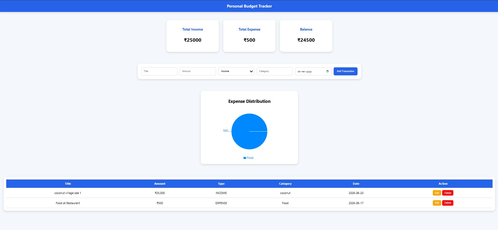
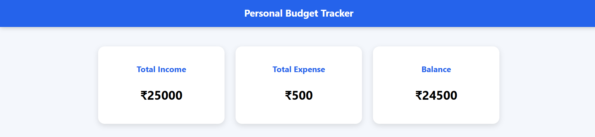
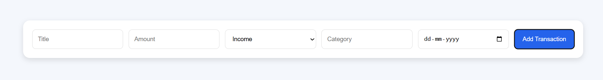
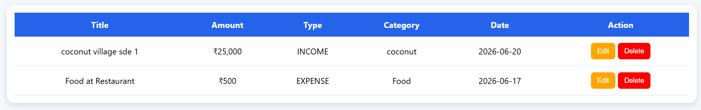
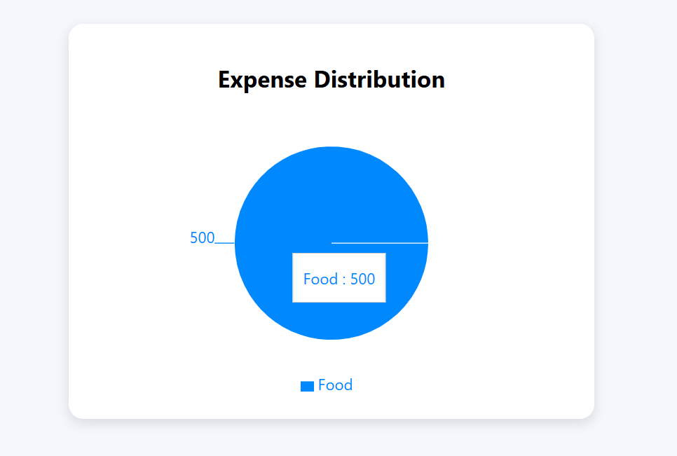

# Personal Budget Tracker

## Overview

Personal Budget Tracker is a full-stack web application developed to help users manage their income and expenses efficiently. Users can add, edit, and delete transactions, view monthly financial summaries, and analyze spending patterns through visual charts.

This project was developed as part of the Azentrix Full Stack Developer Internship Task.

---

## Features

### Transaction Management
- Add income transactions
- Add expense transactions
- Edit existing transactions
- Delete transactions
- View all transactions in a table

### Dashboard
- Total Income Summary
- Total Expense Summary
- Current Balance Calculation

### Analytics
- Expense Distribution Pie Chart
- Category-wise expense visualization

### Database
- Persistent storage using MySQL
- CRUD operations using Spring Boot REST APIs

### UI
- Responsive design
- Mobile-friendly layout
- Clean and user-friendly interface

---

## Tech Stack

### Frontend
- React.js
- Axios
- Recharts
- CSS

### Backend
- Spring Boot
- Spring Data JPA
- REST API

### Database
- MySQL

### Tools
- Git
- GitHub
- Postman
- VS Code
- Spring Tool Suite (STS)

---

## Project Structure

```text
azentrix-fullstack-task1
│
├── budget-tracker-backend
│
├── budget-tracker-frontend
│
├── screenshots
│
└── README.md
```

---

## API Endpoints

### Get All Transactions

```http
GET /api/transactions
```

### Get Summary

```http
GET /api/transactions/summary
```

### Add Transaction

```http
POST /api/transactions
```

### Update Transaction

```http
PUT /api/transactions/{id}
```

### Delete Transaction

```http
DELETE /api/transactions/{id}
```

---

## Backend Setup

### Configure MySQL

Create database:

```sql
CREATE DATABASE budget_tracker;
```

### Update application.properties

```properties
spring.datasource.url=jdbc:mysql://localhost:3306/budget_tracker
spring.datasource.username=root
spring.datasource.password=root

spring.jpa.hibernate.ddl-auto=update
spring.jpa.show-sql=true
```

### Run Backend

```bash
mvn spring-boot:run
```

Backend URL:

```text
http://localhost:8080
```

---

## Frontend Setup

Install dependencies:

```bash
npm install
```

Run application:

```bash
npm run dev
```

---

## Screenshots

### Dashboard


### Income Transaction


### Expense Transaction


### Add Transactions


### Transaction List


### Expense Chart


---

## Future Enhancements

- User Authentication
- Monthly Reports
- Export to PDF
- Dark/Light Theme
- Budget Goal Tracking
- Category Filters

---

## Author

**Nishitha Sirapu**

B.Tech Computer Science and Engineering

KL University

---

## Repository

GitHub Repository:

```text
https://github.com/2300030642/azentrix-fullstack-task1
```
